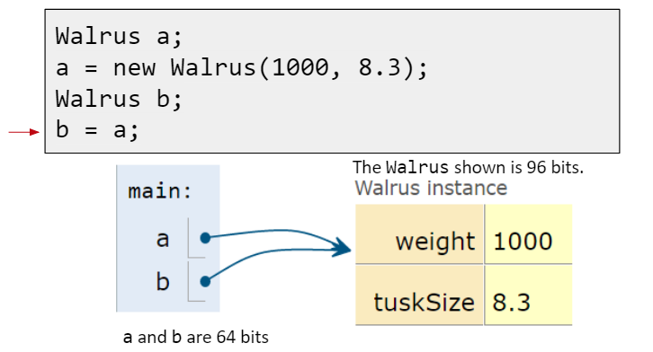
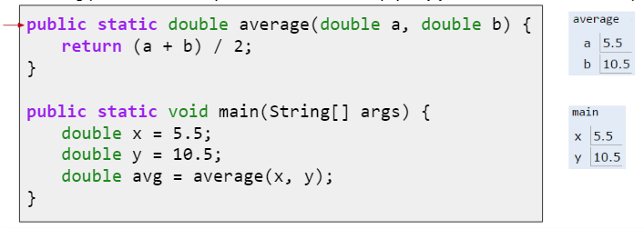
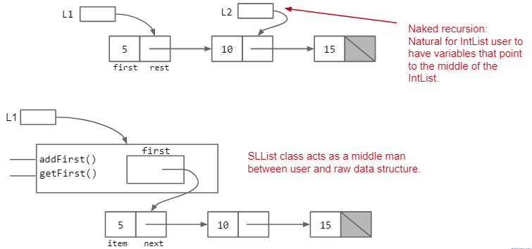
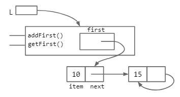
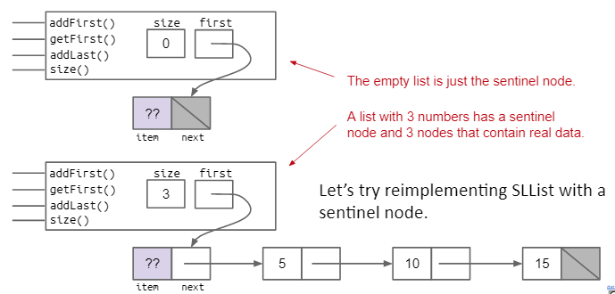
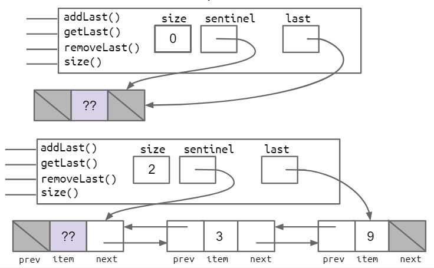
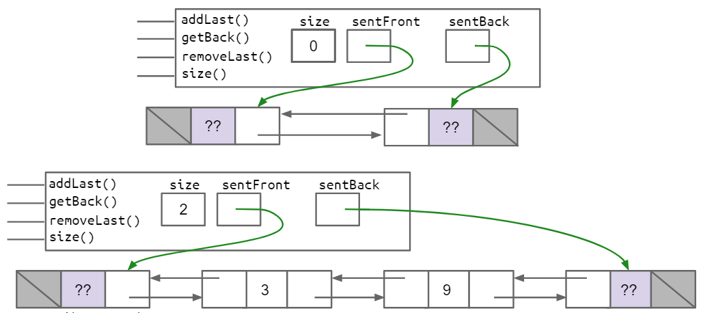
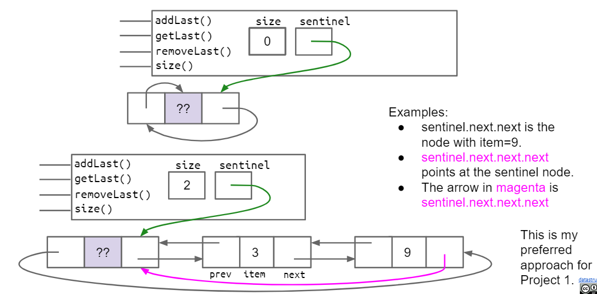
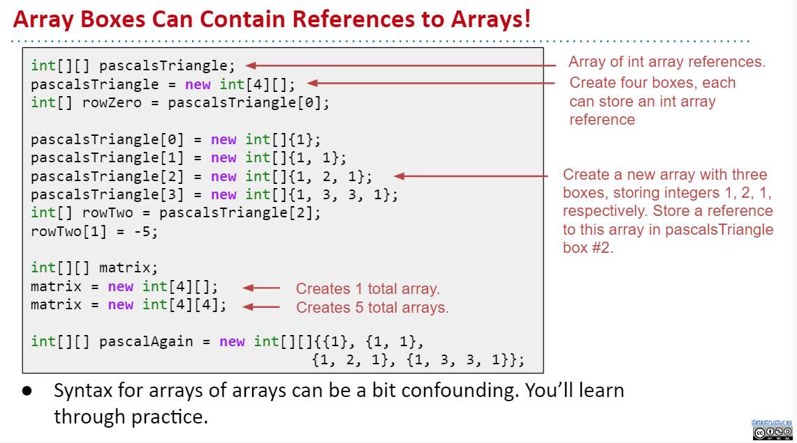

---
html:
    embed_local_images: true
    toc: true
toc:
    depth_from: 1
    depth_to: 2
    ordered: true
export_on_save:
    html: true
---

<!-- Importing styles for numbering sections from H1 -->
<!-- @import "C:\Users\aviat\.atom\mpe-styles\numbering-from-h1.less" -->
<!-- Importing fancy github-light theme -->
<!-- @import "C:/Users/aviat/.atom/mpe-styles/fancy-github-light.less" -->


# Week 2 - Lec.3 & Lec.4 & Lec.5 {ignore=True .ignorenumbering}


## TOC {ignore=True .ignorenumbering}

<!-- @import "[TOC]" {cmd="toc" depthFrom=1 depthTo=2 orderedList=true} -->
<!-- code_chunk_output -->

1. [Lec.3 - References and Recursion](#lec3-references-and-recursion)
    1. [Primitive types](#primitive-types)
    2. [The Golden Rule of Equals (GRoE)](#the-golden-rule-of-equals-groe)
    3. [Reference Types](#reference-types)
    4. [Parameter Passing](#parameter-passing)
    5. [Instantiating Arrays](#instantiating-arrays)
    6. [Introducing IntLists](#introducing-intlists)
2. [Lec.4 - Node Based List](#lec4-node-based-list)
    1. [Rebranding and Bureaucracy](#rebranding-and-bureaucracy)
    2. [Access Control](#access-control)
    3. [Nested Class](#nested-class)
    4. [Caching](#caching)
    5. [Empty list](#empty-list)
    6. [Sentinel Node](#sentinel-node)
    7. [Invariants](#invariants)
3. [Lec.5 - Doubly Linked List and Arrays](#lec5-doubly-linked-list-and-arrays)
    1. [Doubly Linked List](#doubly-linked-list)
    2. [Generics](#generics)
    3. [Arrays](#arrays)
    4. [Arrays vs. Classes](#arrays-vs-classes)

<!-- /code_chunk_output -->


# Lec.3 - References and Recursion

### The Mystery of the Walrus {ignore=True .ignorenumbering}

- Will the change to `b` affect `a` ? / Will the change to `x` affect `y` ?

```java
Walrus a = new Walrus(1000, 8.3);
Walrus b;
b = a;
b.weight = 5;
System.out.println(a);
System.out.println(b);

int x = 5;
int y;
y = x;
x = 2;
System.out.println("x: " + x);
System.out.println("y: " + y);
```

```
weight: 5, tuskSize: 8.30
weight: 5, tuskSize: 8.30
x: 2
y: 5
```

## Primitive types

#### Bits {ignore=True .ignorenumbering}

- Information in computer is stored in **memory** as a sequence of ones and zeros
    * e.g. 72 stored as 01001000
    * e.g. True stored as 00000001

- Each Java type has a different way to interpret the bits:
    * 8 primitive types in Java: byte, short, int, long, float, double, boolean char

### Declaring a Variable {ignore=True .ignorenumbering}

When we declare a variable of a certain type in Java:
- Our computer sets aside exactly enough bits to hold a thing of that type
    * e.g. Declaring an `int x;` sets aside a *box* of 32 bits
    * e.g. Declaring an `double y` sets aside a *box* of 64 bits
- Java creates an internal table that maps each variable name to a location
- Java does **NOT** write anything into the reserved boxes

### Assignment {ignore=True .ignorenumbering}
When we assign a value to the variable:
- Java will fill the *box* with bits representing the variable
    * e.g. `x = 32;`
- Instead of writing memory box contents in binary, we'll write them in human readable symbols


    
## The Golden Rule of Equals (GRoE)

- Given variables `y` and `x`:
    * `y = x` ***copies*** all the bits from `x` into `y`


## Reference Types

> - Each Java type has a different way to interpret the bits:
>     * 8 primitive types in Java: byte, short, int, long, float, double, boolean char

Everything else, including arrays, is a **reference type**

### Class Instantiation

- When we instantiate an Object (e.g. `new Walrus(1000, 8.3);`):
    * Java first allocates a box of bits for each instance variable of the class and fills with a default value (e.g. 0, null)
    * The constructor then usually fills every such box with some other value

### Reference Type Variable Declaration

- When we declare a variable of any reference type (e.g. ``):
    * Java allocates *exactly* a box of size 64 bits, no matter what type of object
    * These bits can either set to:
        + Null (all zeros)
        + The 64 bit *address* of a specific instance of that class (returned by `new`)
- The 64 bit addresses are meaningless to us as humans, so we'll represent:
    * All zero addresses with null
    * Non-zero addresses as arrows
    * => This is sometimes called *box and pointer* notation


### Reference Types Obey the GRoE

- Just as primitive types, the equals sign copies the bits
- In terms of our visual metaphor, we *copy* the arrow by making the arrow in the `b` box point at the same instance as `a`




## Parameter Passing

> - Given variables `y` and `x`:
>    * `y = x` ***copies*** all the bits from `x` into `y`

Passing parameters obeys the same rule: Simply *copy the bits* to the new scope.



### GRoE: Summary {ignore=True .ignorenumbering}

- `b = a` **copies the bits** from `a` into `b`
- Passing parameters **copies the bits**


## Instantiating Arrays

Arrays are also Objects (Reference type) .

```java
int[] a = new int[]{0, 1, 2, 3, 4};
```

- Creates a 64 bit box for storing an int array address: Declaration
- Creates a new Object, in this case an int array: Instantiation
- Puts the address of this new Object into the 64 bit box name `a`: Assignment

**Note**: instantiated Objects can be lost !
If we were to reassign `a` to something else, we'd never be able to get the original Object back !


## Introducing IntLists

> [IntList.java](../lectureCode-sp18/exercises/lists1/IntList.java)
```java
public class IntList {
    public int first;
    public IntList rest;
    
    public IntList(int f, IntList r) {
        first = f;
        rest = r;
    }
    
    /** Methods ... */
    
    public static void main(String[] args) {
        /** Instantiate a list */
        IntList L = new IntList(15, null);
        L = new IntList(10, L);
        L = new IntList(5, L);
        
        /** Methods */
    }
}
```

- While functional, "naked recursive" linked lists like the one above are hard to use
    * Users need to know Java references well, and be able to think recursively


# Lec.4 - Node Based List

## Rebranding and Bureaucracy

Let's move from `IntList` to **singly linked list**: `SLList`

> IntNode.java
```java
public class IntNode {
    public int item;
    public IntNode next;
    
    public IntNode(int i, IntNode n) {
        item = i;
        next = n;
    }
}
```

> SLList.java
```java
/** 
    An SLList is a list of integers, which hides the terrible truth of the nakedness within 
 */
public class SLList {
    public IntNode first;
    
    public SLList(int x) {
        first = new IntNode(x, null);
    }
    
    /**
        Adds x to the front of the list
     */
    public void addFirst(int x) {
        first = new IntNode(x, first);
    }
    
    /**
        Returns the first item in the list
     */
    public int getFirst() {
        return first.item;
    }
    
    public static void main(String[] args) {
        SLList L = new SLList(15); // no need to specify null !
        L.addFirst(10);
        L.addFirst(5);
        int x = L.getFirst();
    }
}
```

- `SLList` is much simpler to use. Simply use the provided methods.
    * Note that there is no efficient way to just add `addFirst` method to `IntList` class.




## Access Control

#### A Potential `SLList` Danger {ignore=True .ignorenumbering}

Users of our class might be tempted to try to manipulate our secret `IntNode` directly in uncouth ways !

```java
SLList L = new SLList(15);
L.addFirst(10);
L.first.next.next = L.first.next;
```



#### `private` keyword {ignore=True .ignorenumbering}

We can prevent programmers from making such mistakes with the `private` keyword.

> SLList.java
```java
public class SLList {
    private IntNode first;
    ...
}
```

Use the `private` keyword to prevent code in *other classes* from using members (or constructors) of a class.

#### Why Restrict Access ? {ignore=True .ignorenumbering}

Hide implementation details from users of our class
- Less for user of class to understand
- Safe for us to change private methods (implementation)


## Nested Class

We can combine two classes into one file pretty simply.

> SLList.java

```java
public class SLList {
    
    public class IntNode {
        public int item;
        public IntNode next;
        
        public IntNode(int i, IntNode n) {
            item = i;
            next = n;
        }
    }
    
    // instance variables, constructors
    // and methods of SLList typically 
    // go below nested class definition
    private IntNode first;
    ...
}
```

Nested classes are useful when a class doesn't stand on its own and is obviously subordinate to another class.

### Private Nested Class

We can make the nested class `private` if other classes should never use the nested class.
In this case, making `IntNode` a nested private class makes sense, because it's hard to imagine other classes having a need to manipulate `IntNode`s.

> SLList.java
```java
public class SLList {
    
    private class IntNode {
        int item;
        IntNode next;
        
        IntNode(int i, IntNode n) {
            item = i;
            next = n;
        }
    }
    ...
}
```

- Unimportant note: For `private` nested classes, access modifiers like `public` no longer really matter.

### Static Nested Class

If the nested class *never uses any instance variables or methods of the outer class*, declare it `static`.

> SLList.java
```java
public class SLList {
    
    private static class IntNode {
        ...
    }
    ...
}
```

- `static` classes can't access outer class's instance variables or methods
    * `static` classes can't access *my* outer class's instance variables
- Results in a minor savings of memory


## Naïve Enhancement {ignore=True .ignorenumbering}

Non-obvious improvements so far:
* `addFirst(int x)`: Rebranding: `IntList` -> `IntNode`
* `getFirst()`: Bureaucracy: `SLList`
* Access control: `public` -> `private`
* Nested class: Bringing `IntNode` into `SLList`

Let's implement `addLast()` and `size()` method !
There are two ways to implement these methods: recursively or iteratively.

> SLList.java
```java
public class SLList {
    ...

    /** Adds a IntNode with item x if IntNode p has no next IntNode */
    private static void addLast(int x, IntNode p) {
        if (p.next == null) {
            p.next = new IntNode(x, null);
        } else {
            SLList.addLast(x, p.next);
        }
    }
    /**
     * Adds x to the last of the list - Recursively
     */
    public void addLast(int x) {
        SLList.addLast(x, first);
    }

    /**
     * Adds x to the last of the list - Iteratively
     */
    public void addLastIterative(int x) {
        IntNode p = first;

        /** Move p until it reaches the end of the list */
        while (p.next != null) {
            p = p.next;
        }

        p.next = new IntNode(x, null);
    }

    
    /** Returns the size of the list that starts at IntNode p */
    private static int size(IntNode p) {
        if (p.next == null) {
            return 1;
        } else {
            return 1 + SLList.size(p.next);
        }
    }
    /**
     * Returns the size of the list - Recursively
     */
    public int size() {
        return SLList.size(first);
    }

    /**
     * Returns the size of the list - Iteratively
     */
    public int sizeIterative() {
        int s = 1;
        IntNode p = first;
        while (p.next != null) {
            s += 1;
            p = p.next;
        }
        return s;
    }
    
    ...
}
```


## Caching

`size()` method can be more efficient: the execution time of `size()` can be independent of the size of the list and always fast

- Solution: Maintain a special size variable that **caches** the size of the list
    * Caching: putting aside data to speed up retrieval
- *TANSTAAAL* ("There ain't no such thing as a free lunch")
    * Spreading the work over each `add*()` call is a net win in almost any circumstance (like below)

> SLList.java
```java
public class SLList {
    private static class IntNode {
        ...
    }

    private IntNode first;
    private int size;
    
    ...
    
    /**
     * Adds x to the front of the list
     */
    public void addFirst(int x) {
        first = new IntNode(x, first);
        size += 1;
    }

    /** Adds a IntNode with item x if IntNode p has no next IntNode */
    private static void addLast(int x, IntNode p) {
        if (p.next == null) {
            p.next = new IntNode(x, null);
        } else {
            SLList.addLast(x, p.next);
        }
    }
    /**
     * Adds x to the last of the list - Recursively
     */
    public void addLast(int x) {
        SLList.addLast(x, first);
        size += 1;
    }

    /**
     * Adds x to the last of the list - Iteratively
     */
    public void addLastIterative(int x) {
        IntNode p = first;

        /** Move p until it reaches the end of the list */
        while (p.next != null) {
            p = p.next;
        }

        p.next = new IntNode(x, null);
        size += 1;
    }
    
    ...
    
    /**
     * Returns the size of the list - Caching
     */
    public int sizeCache() {
        return size;
    }
    
    ...

}
```


## Empty list

We can represent an empty list with the constructor below.

> SLList.java
```java
public class SLList {
    ...
    
    /** Creates an empty list */
    public SLList() {
        first = null;
        size = 0;
    }
    
    ...
}
```

### Bug and Special Case {ignore=True .ignorenumbering}

But this empty list should raise an error when calling `addLast()` method (gonna refer to `null.next`).

One way to fix this is to create a special case for an empty list.

```java
/**
 * Adds x to the last of the list - Recursively
 */
public void addLast(int x) {
    /** Fix the bug with an empty list */
    if (first == null) {
        first = new IntNode(x, null); // addFirst(x); also should work fine instead
        return;
    }

    SLList.addLast(x, first);
    size += 1;
}
```

**BUT**: *Simple code is (usually) good code*

- We want to restrict the amount of complexity in our life !
- Special case aren't simple.


## Sentinel Node

- The fundamental problem here:
    * The empty list has a null `first`, and can't access `first.next` !
- The fix above: a bit ugly
    * Requires a special case
    * Most complex data structures will have many more gross special cases
- => Make all `SLList`s (even empty) the *same* !

Create a special node that is always there. Let's call it a **sentinel node**.



> SLList.java

```java
public class SLList {
    ...
    
    /** The first node (if it exists) is at sentinel.next */
    private IntNode sentinel;
    private int size;

    /** Creates an empty list */
    public SLList() {
        sentinel = new IntNode(63, null);
        size = 0;
    }

    public SLList(int x) {
        sentinel = new IntNode(63, null);
        sentinel.next = new IntNode(x, null);
        size = 1;
    }
    
    /** 
     * The methods below should also be modified
     * to be compatible with sentinel nodes
    */
    ...
}
```

Notes:
- `sentinel` is never null, always points to sentinel node
- Sentinel node's `item` needs to be some integer, but doesn't matter what value we pick
- Had to fix constructors and methods to be compatible with sentinel nodes

Look:
- Having a sentinel simplifies our `addLast()` method
    * No need for a special case to check if `sentinel` is null (since it's never null)

```java
/**
 * Adds x to the last of the list - Recursively
 */
public void addLast(int x) {
    SLList.addLast(x, sentinel);
    size += 1;
}
```


## Invariants

An **invariant** is a condition that is guaranteed to be true during code execution (assuming there are no bugs in our code).
- E.g. Our `SLList` with a sentinel node has at least the following invariants
    - The `sentinel` reference always points to a sentinel node
    - The first node (if it exists), is always at `sentinel.next`
    - The `size` variable is always the total number of items that have been added

Invariants make it easier to reason about code:
- Can assume they are true to simplify code (e.g. `addLast()` doesn't need to worry about nulls)
- Must ensure that methods preserve invariants


# Lec.5 - Doubly Linked List and Arrays

## Singly Linked List to Doubly Linked List {ignore=True .ignorenumbering}

- One downside of `SLList`s: Inserting at the back of an list is much slower than the front
    * How can fix it ?
- Will having a `last` pointer result for fast operations on long list for all the methods below ?
    * `addLast()`
    * `getLast()`
    * `removeLast()`
    * `size()`
- => `removeLast()` gonna be slow, since we don't have *any* pointer to the second last node (like `.last.prev`).


## Doubly Linked List

Reverse pointers allow all operations (`addLast`, `getLast`, `removeLast`) to be fast.
- We call such a list a **doubly linked list** or `DLList` as opposed to our earlier **singly linked list** or `SLList`

This approach, however, has an annoying special case: `last` sometimes points at the sentinel, and sometimes points at a *real* node.



### Fancier Sentinel Node(s)

While fast, adding `.last` and `.prev` introduces lots of special case.

To avoid these, we can either:
1. [Add an additional `sentBack` sentinel at the end of the list](#double-sentinel)
2. [Make our linked list circular, with a single sentinel in the middle](#circular-sentinel)

##### Double Sentinel {ignore=True .ignorenumbering}



##### Circular Sentinel {ignore=True .ignorenumbering}




## Generics

One issue with our list classes: They only supports integers.

Java allows us to defer type selection until declaration using **generics** like below.

> SLList.java
```java
public class SLList<LochNess> {
    private class StuffNode {
        LochNess item;
        StuffNode next;
        
        StuffNode(LochNess i, StuffNode n) {
            item = i;
            next = n;
        }
    }
    
    private StuffNode sentinel;
    private int size;
    
    public SLList() {
        sentinel = new StuffNode(63, null);
        size = 0;
    }
    
    ...
}
```

> SLListLauncher.java
```java
public class SLListLauncher {
    public static void main(String[] args) {
        SLList<String> s1 = new SLList<>("bone");
        // SLList<String> s1 = new SLList<String>("bone"); 
        // should also work even though more verbose
        s1.addFirst("thugs");
    }
}
```


##### Rules of thumb of generics {ignore=True .ignorenumbering}

- In the .java file implementing our data structure, we have to specify "generic type" **only once** at the very top of the file: e.g. `<LockNess>`
- In the .java files that **use** our data structure, we specify desired type **once**
    * Write our desired type during **declaration**
        + e.g. `SLList<String> s1`
    * Use the empty diamond operator `<>` during **instantiation**
        + e.g. `new SLList<>("bone");`
- When declaring or instantiating our data structure, we use the reference type below
    * `int` -> `Integer`
    * `double` -> `Double`
    * `char` -> `Character`
    * `boolean` -> `Boolean`
    * `long` -> `Long`
    * etc ...


## Arrays

#### Look Back At Memory A Bit {ignore=False .ignorenumbering}

- To store information, we need memory boxes, which we can get in Java by declaring variables or instantiating objects. E.g.:
    * `int x;`: Gives us a memory box of 32 bits that stores ints
    * `Walrus w1;`: Gives us a memory box of 64 bits that stores `Walrus` references
    * `Walrus w2 = new Walrus`: Gives us a memory box of 64 bits that stores `Walrus` references, and also gives us 96 bits for storing the int `wight` and double `tuskSize` of our `Walrus`

### General Features of Array

- **Arrays** are a special kind of object which consists of a **numbered** sequence of memory boxes
    * To get $i$ th item of array `A`: `A[i]`
    * Unlike class instances which have *named* memory boxes
- Arrays consist of:
    * A **fixed** integer length (can't change !)
        + c.f. Linked list can expand till it use up memory
    * A sequence of `N` memory boxes where `N == length`, such that:
        + **All of the boxes hold the same type of value** (and have same number of bits)
        + The boxes are numbered `0` through `length - 1`
- Like instances of classes:
    * We get one reference when it's created
    * If we reassign all variables containing that reference, we can never get the array back
- Unlike classes, arrays do not have methods

### Basics Array Syntax

Three valid notations to instantiate array in Java:
1. `x = new int[3];`: Creates array containing 3 int boxes (32 x 2 = 96 bits total) and each container gets a default value `0`
    * c.f. `String[] s = new String[6];`: Creates array containing 6 *String reference* boxes (64 x 6 bits total) and each container gets a default value `null`
2. `y = new int[]{1, 2, 3, 4, 5};`
3. `int[] z = {1, 2, 3, 4, 5};`: Can omit the `new` if we are also declaring a variable

#### Copy Array {ignore=True .ignorenumbering}

Two ways to copy arrays:
1. Item by item using a loop
2. Using `arraycopy`:
    * `System.arraycopy(x, 0, y, 2, 3);`
    * (In Python: `y[2:5] = x[0:3]`)
    * Takes 5 parameters
        + Source array
        + Start position in source
        + Target array
        + Start position in target
        + Number to copy
    * Likely to be faster, particularly for larger arrays, and gives more compact code

### 2D Array




## Arrays vs. Classes

- Array indices **can be computed at runtime**

```java
int[] x = new int[]{100, 101, 102, 103};
int indexOfInterest = askuser();
int interestedInt = x[indexOfInterest];
```

- Class member variable names **CANNOT** be computed and used at runtime
    * The only (easy) way to access a member of a class is with *hard-coded* dot notation

```java
String fieldOfInterest = "mass";
Planet earth = new Plane(6e24, "earth");
double interestedField = earth[fieldOfInterest]; // cause error
// earth.fieldOfInterest doesn't work either.
```
